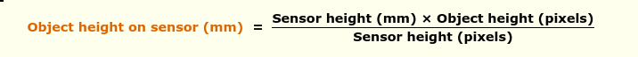
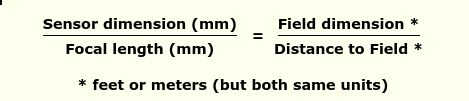

## Finding size of object given the distance

Constants:

    - Resolution: 1280 x 800 (px)

    - Focal Length: 1.93mm

    - Sensor size: 3.896 x 2.453 (mm)

Inputs: 

    - Size of Object in pixels (Obtained from segmentation model mask)

    - Distance to object (Obtained from trimmed mean of above mask with depth map)




ref: [scantips](https://www.scantips.com/lights/subjectdistance.html)

<br/>

## Finding relative position vector

Using the same constants as above.
Once we calculate the field dimension, we get the relative position as follows:
```python
field_dim = ...
realsense_width = ... # in mm
object_center = ... # In pixels

relative_position = (object_center[0] / realsense_width) * field_dim
```




ref: [scantips](https://www.scantips.com/lights/fieldofviewmath.html)
